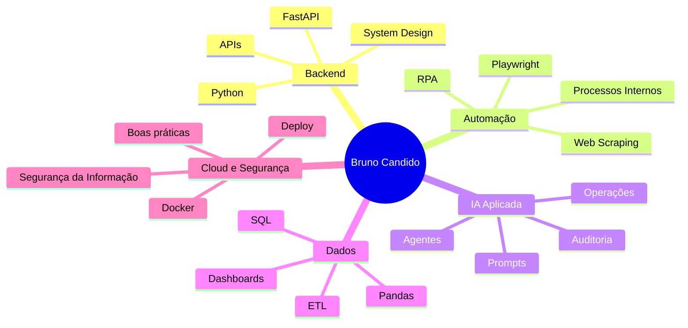

<div align="center">


# 👨🏻‍💻 Hey, eu sou o Bruno

### Bem-vindo ao meu GitHub Universe


<br/>

<a href="https://github.com/by-BC">
  
</a>
<a href="https://github.com/by-BC?tab=repositories">
  
</a>
<a href="https://www.linkedin.com/in/brnocandido/">
  
</a>

</div>

---

<table>
<tr>
<td width="58%">

## 🧭 Sobre mim

Atuo no setor de **TI da Analisegroup**, desenvolvendo soluções voltadas para **automação de processos**, **inteligência artificial aplicada**, **integração de sistemas**, **dados** e **ferramentas internas**.

Sou estudante de **Análise e Desenvolvimento de Sistemas** e venho construindo projetos que unem tecnologia, operação e visão de negócio.

```python
class BrunoCandido:
    def __init__(self):
        self.role = "Analista de TI"
        self.company = "Analisegroup"
        self.location = "Arapiraca - AL"
        self.focus = [
            "Python",
            "Backend",
            "Automação de Processos",
            "Inteligência Artificial",
            "RPA",
            "APIs",
            "Data Processing"
        ]
        self.current_goal = "Criar soluções simples para operações complexas"

    def build(self):
        return "software útil, prático e escalável"
```

</td>
<td width="42%" align="center">


<br/>
<br/>


</td>
</tr>
</table>

---

## 🛠️ Tech Stack

<div align="center">


</div>

<br/>

<table align="center">
<tr>
<td align="center" width="25%">
<b>Backend</b><br/>
Python · FastAPI · APIs REST
</td>
<td align="center" width="25%">
<b>Automação</b><br/>
Playwright · RPA · Web Scraping
</td>
<td align="center" width="25%">
<b>Dados</b><br/>
Pandas · SQL · ETL
</td>
<td align="center" width="25%">
<b>Frontend</b><br/>
React · Vite · Tailwind · Streamlit
</td>
</tr>
</table>

---

## 🚀 Projetos em destaque

<table>
<tr>
<td width="50%">

### ⚽ Onde Passa FC
Plataforma web para acompanhar jogos, transmissões, tabelas, estatísticas e simulações do futebol brasileiro.

**Stack:** `React` `TypeScript` `Vite` `Tailwind` `Supabase`

<a href="https://github.com/by-BC/onde-passa-FC">
  
</a>

</td>
<td width="50%">

### 🧠 IA-First
Repositório voltado para cultura de IA, automações e uso estratégico de inteligência artificial em processos internos.

**Stack:** `HTML` `IA` `Documentação` `Processos`

<a href="https://github.com/by-BC/IA-First">
  
</a>

</td>
</tr>
<tr>
<td width="50%">

### 📊 Unificador de Dados Contábeis
Sistema em Python para padronização, consolidação e análise de extratos bancários em múltiplos formatos.

**Stack:** `Python` `Pandas` `Dados` `Automação`

<a href="https://github.com/by-BC/unificador-dados-contabeis">
  
</a>

</td>
<td width="50%">

### 🧾 Auto-NFSe
Automação para emissão e controle de notas fiscais eletrônicas usando navegador automatizado.

**Stack:** `Python` `Playwright` `SQLite` `RPA`

<a href="https://github.com/by-BC/auto-nfse">
  
</a>

</td>
</tr>
</table>

---

## 📈 GitHub Analytics

<div align="center">


<br/>
<br/>


<br/>
<br/>


</div>

---

## 🏆 Conquistas e métricas

<div align="center">


</div>

---

## 🧩 Atualmente construindo

<table>
<tr>
<td width="33%" align="center">
<br/>
Agentes, prompts, fluxos e automações inteligentes.
</td>
<td width="33%" align="center">
<br/>
Ferramentas internas para reduzir retrabalho operacional.
</td>
<td width="33%" align="center">
<br/>
Tratamento, padronização e auditoria de dados.
</td>
</tr>
</table>

---

## 🗺️ Roadmap pessoal



---

## 📬 Contato

<div align="center">

<a href="https://github.com/by-BC">
  
</a>
<a href="https://www.linkedin.com/in/brnocandido/">
  
</a>

<br/>
<br/>


</div>
